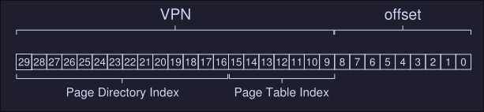

# 13. Paging - Smaller Tables
Assume we have the following system: 
- 32-bit address space (2${^{32}}$ bytes)
- 4KB (2${^{12}}$ bytes) pages
- 4-byte page-table entry
We then have roughly $\frac{2^{32}}{2^{12}}$ virtual pages, that's $1.048.576$, and considering that each page table entry is 4-bytes, we have $1.048.576 * 4$  bytes of memory used for the page table only, that is about 4MB in size. We usually have one page table for every process, that is a lot of memory usage for the page table only. How can we decrease this memory usage? 

## Simple solution: Bigger pages
If we increase our page table by 4 (that is from 4KB to 16KB), we then decrease or page table memory usage for a process from 4MB to 1MB. The reduction exactly mirrors the factor that we increase our page size. 
The main problems with this solutions is internal fragmentation, we are allocating too much memory for process that might not use all. 

## Hybrid approach: Paging and segments
We combine paging and segmentation in order to reduce the memory overhead of pager tables. We can see why this might work by examining a typical linear page table in more detail: 
Assume we have: 
- An address space with used portions of the heap and stack are small
- A tiny 16KB address space with 1KB pages


Here we have a virtual address space with a code, a heap and a stack segment. However we are only using 1 page on each segment. Page 0 (Code) maps to physical frame 10, Page 4 maps to 23, Page 14 maps to 4 and 15 maps to 28. Most of the pages on our address space are unused, this is a waste of space in our page table, because it stills has to storage 16 entries. 

**Our hybrid approach:** Instead of having a single page table for our entire virtual address space, we have a page table for each segment (1 table for code, 1 table for heap and 1 table for stack).

What each register will mean on our segment approach: 
- **base** register: Holds the physical address of the page table of that segment
- **bound** register: Used to indicate the end of the page table

### Example
Assume: 
- 32-bits virtual address space 
- 4KB pages
- Address space split into four segments
- We'll only use three segments for this example, code, heap and stack.
- To determine a segment an address refers to, we'll use the top two bits of the address space: 
	- `00` is the unused segment 
	- `01` for code
	- `10` for the heap
	- `11` for the stack
- Our virtual address looks like this:


- The base register for each segment contains the physical address of a linear page table for that segment
- Each process has now 3 page tables
- On context switch, this registers are changed

Main differences with this hybrid approach and the first one: 
- The segment page table will only have the entries that are allocated. Unallocated pages between the stack and the heap no long take up space in a page table 

Problems: 
- If we have a large but sparsely used heap, for example, we can still end up with a lot of page table waste
- This solutions causes external fragmentation, page tables now can be of arbitrary size, thus finding free space for them in memory is more complicated. 


## Multi-Level page tables
*It turns the linear page table into something like a tree.*
The basic idea behind a multi-level page table is simple: 
1. Chop up the page table into page-sized units
2. If an entire page of page-table entries is invalid, don't allocate that page of the page table at all
3. To track whether a page of the page table is valid, use a new structure, called the page directory (note: Each process has his own page directory structure)
4. The page directory, can be used to tell you where a page of the page table is, or to tell if the entire page of the page table contains no valid pages


On this image we can see: 
- **PDBR:** Page directory base registers,  this holds the physical address where the page directory is.
- The page directory: Maps to a page that contains a page table (this can be initialized or not initialized )
- Just two page-table are mark as valid (1), hence only this 2 are initialized in memory

The page directory: 
- It contains one entry pert page of the page table
- It consist of a number of page directory entries (PDE) which has a *valid* bit and a page frame number (to what frame number that page table maps to)
- If the PDE is valid, it means that at least one element on the page table is valid 

### Advantages of multi-level pages
- Only allocates page-tables space in proportion to the amount of address space you are using
- If carefully constructed, each portion of the page table first neatly within a page, making it easier to manage memory 
### Cost of multi-level pages
On TLB miss, two loads from memory will be required to get the right translation information from the page table, one for the page directory and one for the PTE itself. 

## Example multi-level page tables
We have the following system: 
- Small address space of size 16KB
- 64-byte pages
- 14-bit virtual address space
- 8 bits for the VPN
- 6 bits for the offset
- A linear page table would have 2${^8}$ entries

For this example we have virtual page 0 and 1 for code, virtual page 4 and 5 for the heap, virtual pages 254 and 255 for the stack. The rest is **unused** 


### Building a two-level page table
- We start with our full linear page table, and break it up into page-sized units (each page is 64 bytes in size). 
- Full table has 256 entries
- Assume each PTE is 4 bytes, hence our entire table is using 256 * 4 bytes = 1024 bytes
- Because our page size is 64, we are using 16 pages for our page table

Todo: How to take a VPN and use it to index first into the page directory and then into the page of the page table. 

First, to index the page directory: We can do this by using 4 bits of our VPN bits, we need 4 bits because we have 16 possible pages to reference, 2${^4}$ = 16.

From here we can use the page directory index to get our page directory entry (PDE) with a simple calculation: `PDEAddr = PageDirBase + (PDIndex * sizeof(PDE)` 
- This is our page directory entry is marked invalid, we know that the access is invalid and raise and exception. 
- If the PDE is valid, we fetch the page table entry (PTE) from the page of the page table pointed to by this page directory entry, to find the PTE we use the remaining bits in our VPN


This can be then used to index into the page table itself, here `PDE.PFN` is the page frame number of the page (or the address of the first element on the PDE) which is the indexed to the page table index we want: 
```
PTEAddr = (PDE.PFN << SHIFT) + (PTIndex * sizeof(PTE))
```

### More than two levels
We have the following situation: 
- 30 bit virtual address space (the max address number I can represent is 30 bits)
- A 512 bytes page (max number I can represent is 9 bits)
- Hence our virtual space uses 21 bits to reference the page and 9 bits to reference the exact memory address inside that page 

Our goal when constructing a multi-level page table: Make each piece of the page table fit within a single page (meaning our page directory must fit inside a single page). 

#### How to determine how many levels are needed on a multi-level table?
- First we start by deterring how many page-table entries fit within a page: On our example, a page has a size of 512 bytes, and a PTE has a size of 4 bytes, which means a page can fit up to 128 PTEs. This means that we need 7 bits to represent the 128 values a page-table entry may have. 



- As we can see, we have 7 bits for the page table index (to index PTE) and 14 bits for the page directory entries 
- If we have 14 bits for the page directory index, that would mean 2${^{14}}$ entries on our page directory, which spans not one page but 128, and thus our goal of making the directory entry fit on one page fails. 
To fix this, we create a further level of the tree, by spiting the page directory itself into multiple pages, and then adding another page directory on top of that. A memory reference number would look like this: 


*Note: This "more than two levels" part is incomplete*
