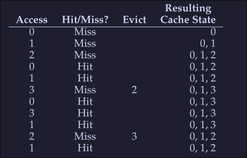

# 15. Physical Memory - Policies
When there's no much memory free, the operating system is forced to start paging out pages to make room for actively-used pages. Deciding which page to evict and which page not to is described in the replacement policy. 
## Cache management
- We can view memory as cache: *main memory holds some subset of all the pages in the system*
- Our goal: Picking a replacement policy for this cache to minimize the number of cache misses (minimize number of times we fetch pages from disk)
- A nice metric to measure the cache misses and hits is the average memory access time (AMAT) for a program: 
$$
AMAT = T{_M} + (M_{Miss} \cdot T_D)
$$
- $T_M$ cost of accessing memory
- $T_{D}$ cost of accessing disk
- $P_{Miss}$ probability of a cache miss
- We always pay the cost of accessing the data in memory

### Example
We have: 
- 4KB address space
- 256-byte pages
- Virtual address has two components, a 4-bits VPN (Used to reference the page frame number on a page table) and an 8 bits offset (Used to calculate the offset from a given page address)
- Process can access a total of 16 virtual pages

Now assume we have the following address `0x000`, `0x100`, `0x200`, `0x300`, `0x400`, `0x500`, `0x600`, `0x700`, `0x800` and `0x900` where each of these addresses reference the beginning of a page (the first element of a page)
All pages referenced on the previous address are on memory except for page number 3 (`0x300`). Hence when trying to access each of these addresses we will encounter the following behavior:
```
hit, hit, hit, miss, hit, hit, hit, hit, hit, hit
```
Our hit rate would be 90%, miss rate 10%, hence $P_{miss} = 0.1$. To calculate AMAT, we need to know the cost of accessing memory and the cost of accessing disk, let's assume that the cost of accessing to memory ($T_M$) is around 100 nano seconds and the cost to access disk ($T_{D}$) is around 10 miliseconds, we have the following AMAT :
$$
AMAT = T_{M} + (M_{Miss} \cdot T_{D}) = 100ns + 0.1 \cdot 10ms
$$
Which is
$$
= 1,0001 ms
$$

As you can see the cost of disk is so high compared to the cost of reading to memory that we clearly need to avoid as many misses as possible or we will run slowly at the rate of the disk. 

## Optimal Replacement Policy
- The optimal  replacement policy is a simple policy that replace the page that will be accessed furthest in the future, resulting in the fewest possible cache misses. (Easy to say, really hard to implement)
- If we need to throw a page, why not just throw the page that we will need the furthest from now

### Example 
We access the following virtual pages: 0,1,2,0,1,3,,3,1,2,1 


As expected we start with 3 misses, we load the pages to memory, then when miss when accessing 3, here we look to the future to check which page we will be accessing last, we see that 0 is acceded intermediately after and that 1 is also accessed a little after that, then we see that the last one is 2, hence we evict 2. After this, we we access 2 (the last miss on the table) we see that both 3 and 0 are valid eviction candidates so we kick either one. 

- Hit rate: 
$$HitRate = \frac{Hits}{Hits + Misses} = \frac{6}{6+5} = 54.5\% $$
- Hit rate *modulo* (Ignore the first miss for a given page): 
$$HitRateMod = \frac{Hits}{Hits + Misses} = \frac{6}{6+1} = 85.7\% $$

This policy will only be useful when comparing other alternatives to see how far are we from the "perfect" policy

## Simple policy: FIFO
- Pages are placed in a queue when they enter the system
- When a replacement occurs: The page on the tail of the queue is evicted

Let's examine the first example (on Optimal Replacement Policy): 


We again begin with 3 misses, the we encounter 2 hits and a miss on access to page 3, since our first in was 0, then this page is evicted. We get a miss on 0 right after that, so we evict 1 because it was the first one to get into the list. Then again we get a miss with 1 and 2 and evict the corresponding pages. 
- Hit rate: 
$$HitRate = \frac{Hit} {Hit + Miss} = \frac{4}{4 + 7} = 36.4\% $$
- Hit rate *modulo*
$$HitRateMod = \frac{Hit}{Hit + Miss} = \frac{4}{4 + 3} = 57.1\% $$
We see a much worse performance, because FIFO can't determine the importance of blocks; even though 0 had been accessed a number of times, FIFO still kicks it out.  

## Simply Policy: Random
- It simply picks a random page to replace under memory pressure.
- It is simple to implement
- It isn't too intelligent in picking which blocks to evict

On our example above, after running the random policy 1000 times we see the following results:  


We see that about 40% of the time, Random is as good as optimal achieving 6 hits no the example trace. Sometimes it does much worse tho, achieving 2 or less hits. How random achieves is purely luck.  

## Using History: LRU
We need a smarter policy, FIFO and Random might kick important pages that will be accessed right after they are evicted. 
- We can use *history* as a guide, if a program has acceded a page in the near past, it is likely to access it again in the near future. 
- Frequency can also be used: If a page has been accessed many times, perhaps it should not be evicted
- Recency of access: A The more recently a page has been accessed, perhaps the more like it will be accessed again 
All this policies are based on the principle of locality
**Principle of locality:** An observation about programs and their behavior, programs tend to access certain code sequences and data structures quite frequently, we should thus try to use history ot figure out which pages are important and keep those pages in memory when it comes to eviction time 


**LRU: Least-Frequently-Used** policy replaces the least-frequently-used page when an eviction must take place. 
**LRU: Least-Recently-Used** policy replaces the least-recently-used page when an eviction must take place. 


(It's like a FIFO but based on time)
When we encounter a miss on 3, we see which one was the least recently used, in this case is 2 so this is evicted, next we get a miss on 2, and we see that 0 is the least recently used so we evict that. 

## Workload examples
