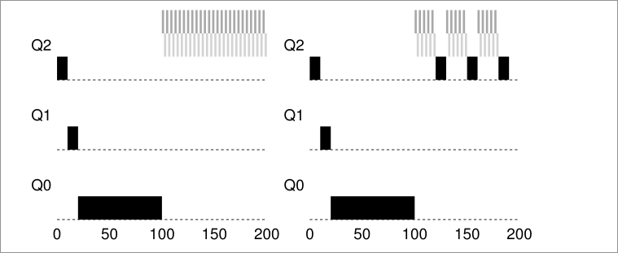

# 5. Multi-Level Feedback Queue
## Goals: 
- Minimize turn around time (Time of completion - Time of arrival)
	- Problems:  
		- Minimizing the turnaround time is usually done by running the shortest job first
		- We don't know how long a process will take to run. 
- Minimize response time
	- Problems: 
		- Usually minimizing response time results in a bad turnaround time

#### Crux: How to schedule without perfect knowledge

## MLFQ: Basic rules
We have a number of queues, each of one has a different priority. At any give time, a job that is ready to run a job is **on a single** queue. The scheduler chooses the highest priority job to run, if there are many jobs with the same priority, Round Robin it's used on that queue. 
1. **Rule 1:**  If Priority(A) > Priority(B), A runs (B doesn't)
2. **Rule 2:** If priority (A) == Priority(B), A && B run in RR

* MLFQ varies process priority based on observed behavior: 
	* If process yields CPU control while waiting or input keyboard, it get's higher priority (short execution times). 
	 - If process uses the CPU for long times without I/O, it get's lower priority. 
  * Current problems: Highest priority jobs will always get to run, and lowest priority jobs will never run. 
  
### 1. Change priority
1. **Rule 3:** When a job enters the system, it is placed at the highest priority.
2. **Rule 4a:** If a job uses his entire time slice while running, it's priority it's reduced
3. **Rule 4b:** If a jobs gives up the CPU before the time slice is up, it stays at the same priority level.

* Current problems with MLFQ:
	* Starvation: If there are too many high priority processes (short running processes), then they'll use all the CPU time and the long-running jobs will never run. 
	 - A user could trick to make the scheduler think our process is a short job by doing an I/O operation just before the time slice is over, thus keeping our job on the same priority queue.
	  - A program may change its behavior over time; what was CPU bound may transition to a phase of interactivity. 
### 2. Priority boost
To avoid the problem of starvation, we could periodically boost the priority of all the jobs in system. 
1. **Rule 5:** After some time period *S*, move all the jobs in the system to the topmost queue 
Problems that solves this rule: 
- By sitting on the top queue our process are guaranteed not to starve because all jobs in the queue share the CPU in a round-robin fashion.
- If a CPU-bound job has become interactive, the scheduler treats it properly once it has received the priority boost. 

On the left, without priority boost, process in black get's starved once the short jobs arrive to the CPU, on the right however, with a priority boost every 50ms, the long running process it's guarantee to make some progress because it get's boosted to the top queue every 50ms and thus getting to run periodically. 

#### How to set the time period *S* ? 
These values are called voo-doo constants because some form of *black magic* is needed to set them correctly. 
* If *S* is set too high, long running jobs could starve. 
* If *S* is set too low, interactive jobs mayt not get a proper share of the CPU.

### 3. Better accounting 
How we prevent gaming of our scheduler? We set a time max of how much a process can run, by *remembering* how long has he run and making the total sum, if it's greater than the max, we decrease his priority. 
Hence we rewrite rules *4a* and *4b*: 
1. **Rule 4:** Once a job uses up its time allotment at a given level (regardless of how many time it has give up the CPU), it's priority it's reduced. (i.e., it moves down one queue) 
## Summary: 
MLFQ has multiple levels of queue and uses feedback to determine the priority of a given job. History is its guide: Pay attention to how jobs behave over time and treat them accordingly. 
Refined set of MLFQ rules:
* **Rule 1:** If Priority(A) > Priority(B), A runs (B doesn't) 
* **Rule 2:** If Priority(A) = Priority(B), A & B run in round-robin fashion using the time slice of the given queue. 
* **Rule 3:** When a job enters the system, it is placed at the highest priority. 
* **Rule 4:** Once a job uses up its time allotment at a given level (regardless of how many times it has given up the CPU), its priority is reduced.
* **Rule 5:** After some time period *S*, move all the jobs in the system to the topmost queue. 
