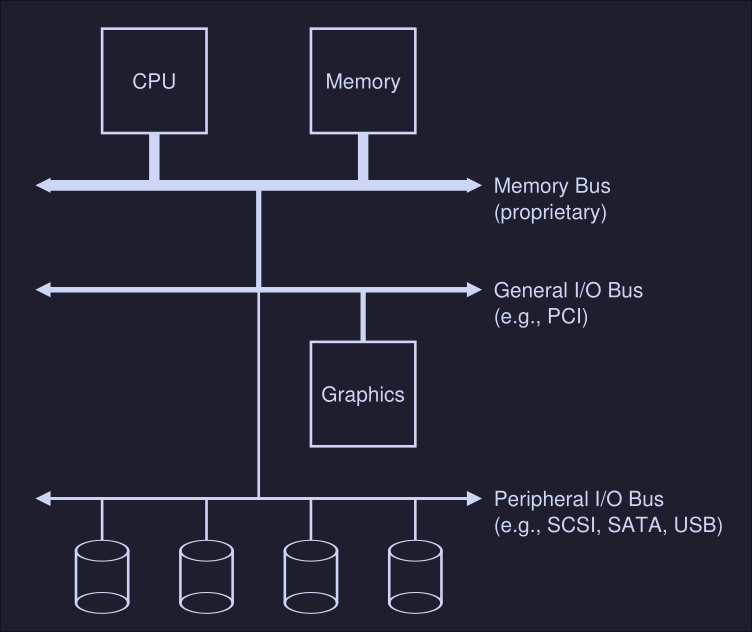
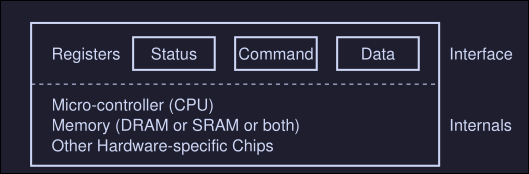
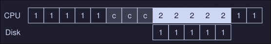
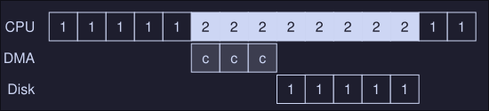
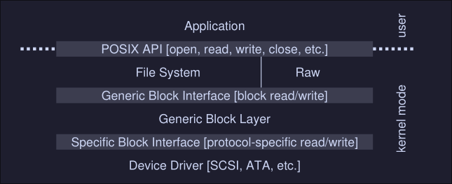

# I/O Devices

I/O refers to input and output. It's a critical part of an operating system. A program without any input produces the same result each time, and a program without an output doesn't really make sense.

## System architecture
Let's begging by looking a "classical" diagram of a typical system. 

<center></center>

Here we can see: 
- CPU attached to the main memory of the system via a memory bus 
- Some devices connected to the system via general I/O bus (PCI in modern systems)
- Graphics and some other higher-performance I/O devices are usually found on memory busses
- Lower down, we see the peripheral bus, SCI, SATA or BUS are here. These connect slow devices (disk, mice, keyboards, etc) to the system. 

Why not put everything on the memory bus? It's expensive, the higher the bus in the hierarchy, the short must be (technological limitation). 

## A Canonical Device
We now look a canonical device (not a real one) to see the two most important components of a devices.

<center></center>

We see that we have:
- **Hardware interface** which an interface that allows the system software to control the hardware. All devices have some specified interface and protocol for typical interaction
- **Internal structure** which is implementation specific (meaning is usually different for every device) and it's responsible for implementing the abstraction the device presents to the system

## The Canonical Protocol
On the canonical device picture, we see 3 registers on the interface component: 
1. Status register: It is read to see the current status of the device
2. Command register: To tell the device to perform a certain task
3. Data register: To pass data to the device, or get data from the device

A typical interaction of the OS with the device would look something like this: 

```
While (STATUS == BUSY)
	; // Wait until device is not busy
Write data to DATA register
Write command  to DATA register
	(starts the device and executes the command) 
While (STATUS == BUSY)
	; // wait until device is done with your request
```

This is called a protocol and it these case we see 4 steps:
1. The OS waits until de device is not busy (we are *polling* the device)
2. Once the device is not busy, we write data to the DATA register
3. The OS writes a command to the command register
4. The OS waits for the device to finish by again polling it

This works fine, but there are some problems, the most obvious one is that the waiting (*polling*) action is inefficient and wastes CPU time 

## Lowering CPU Overhead with Interrupts
The solution of constantly waiting for the device to became available can be to instead implement interrupts. The OS issues a request and puts the process to sleep, when the hardware device is available, it raises a hardware interrupt that will be handled by the OS by jumping to an interrupt service routine (ISR), also known as interrupt handler. 

This is more efficient since it allows another process to run while we wait for an I/O hardware operation to finish. This is not always the best solution, if the device is fast, it might be better to poll or if we don't know, an hybrid approach might also be good. 

## More Efficient Data Movement With DMA
When using programmed I/O (PIO) we transfer large chunk of data to a device, this is done by copying the data from memory to the device explicitly, one word at a time (marked `C` in the diagram)

<center></center>


This uses CPU time. To fix this, we use something called **Direct memory access** that basically transfers between devices and main memory without much CPU intervention. 

<center></center>

First, the OS would program the DMA engine by telling it where the data we want to transfer lives in memory, how much data is and which device to send it to, then the OS is done and we can switch to process `2` in this case. 

## Methods of Device Interaction
How does the OS actually communicates with the device? There are two methods:
1. The oldest is with **explicit I/O instructions**: These instructions tell the OS to send data to a specific device register. For example on x86 we have the `in` and `out` instruction which can be used to communicate with devices, to send data to a device, the caller specifies a register with the data in it, and a specific port which names the devices. 
2. The second method is known as **memory mapped I/O**, with this method, the devices makes his registers available as it where memory locations, to access a particular register, the OS issues a load (or a read) or store (to write) the address.  Then the hardware routes the action to the devices instead of the main memory. 

## The device Driver
We need to keep most of the OS device-neutral, hiding the details of device interactions from major OS subsystems. This problem is solved through abstraction.
This particular abstraction has many components: 
- At the lowest level, we encounter the device driver, which encapsulates any specifics of device interactions
- Multiple abstraction layers

<center></center>

Here we can see that the file system doesn't know specifics of which disk class it is using, it simply issues block read and write request to the block "Generic Block Layer", this layer routes the request to the proper device driver instructions which handles the details of issuing the specific request. 