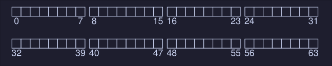

# File System Implementation
Here we make an overview of the VSFS (Very Simple File System). 

## The Way to Think
We need to understand 2 aspects of filesystems in order to 

- Data Structures of the file systems: What types of on -disk structures are used by the file system to organize its data and metadata.
- Access methods: How does it map the calls made by a process, such as `open()`, `read()`, `write()`, etc, into its structures

If we understand the data structures and the access methods of the file system we can understand how it works.

## Overall Organization
- We divide the disk into blocks, we will choose a block size of 4 KB. 
- Our view of the file system will be series of blocks of size 4 KB, they are addressed from 0 to N - 1

Let's imagines we have the following disk:

<center></center>

Here we have a file system with 64 blocks.
What we will need to store in this file system: 
- User data: This is stored on the "data region"
- We need to keep track of information about each file. This information is part of the metadata, track thing like which data blocks comprise a file, this is usually stored on  a structure called inode. 
- Inodes are stored in the disk as well, on a section called the **inode table**, which holds an array on inodes, assuming 256 bytes per inode, 4-KB block can hold 16 inodes, in our file system below we use 5 block for the inodes, meaning we can hold 80 inodes. This number (80 inodes) represent how many files our file system supports.
- We also need a structure to keep track which inodes and blocks are free and which are used, these is called an allocation structure.
- Here we choose to use a bitmap, to keep track of the inodes and the blocks. 
- `i` is the bitmap for the inodes and `d` the bitmap for the blocks

Our filesystem is looking like this:

<center></center>

The reminding block (the first one starting from the left) is reserved for the **superblock**, which contains information about this particular filesystem, some information that might be on the superblock is:
- How many inodes are in the file system (80)
- How many data blocks are in the system (56) 
- Where the inode table begins (block 3)
- etc..

It will also contain a magic number to identify the filesystem. 

Our final file system would look like this: 

<center></center>

## File organization: The Inode 
Short name for index node. Each inode is referred with a number (called low-level name before), given an i-number, we should be able to locate where on the disk is the inode.

Let's zoom in into the inode table of the filesystem described above: 

<center></center>

To read the inode 32 the file system would calculate the offset into the inode region (`inode_index * inode_size`) and add it to the start address of the inode table on disk (`inodeStartAddr = 12KB`) arriving to the correct byte address of the block of inodes: 20KB. 

However, because disks are not byte addressable, we need to address a larger sector (512 bytes), hence to fetch the block of inodes that contain the inode 32, we would read to sector \\( \frac{20 \cdot 1024}{512} = 40  \\) to fetch the desired inode block

Inside the inode, there's all the metada of the file. One important part of this metadata is the one that tells use where the data blocks of the file are. This is filesystem dependent, and a simple approach would be to have one or more direct pointers inside the inode; each one points to a block that belongs to the file, if we have a number of reference to blocks large than the size of the inode, we are out of luck.

### The Multi-Level Index
To support bigger file, we introduce an idea known as an indirect pointer: *Instead of pointing to a block that contains user data, it point to a block that contains more pointers, each of which point to user data*

Hence if an inode has a max size of pointer (e.g, 12) and a single indirect pointer. If a file grows large enough, an indirect block is allocated and the inode's slot for an indirect pointer is set to point to it. 

Assuming 4-KB blocks, 4 bytes disk addresses, that adds another 1024 pointers, the file can grow to be (12 + 1024) * 4K = 4144KB 

To support even larger files, add another pointer to the inode. 

## Directory Organization
In VSFS directories have a simple organization, a directory contains a list of `(entry name, inode number)` pairs.

If we have a directory `dir` with inode `5` that has three files: [`foo`, `bar` and `foobar_is_a_pretty_longname`], with inode numbers `12`, `13` and `24` , the on-disk data for `dir` might look like this: 
```
inum | reclen | strlen | name
  5      12        2     .
  2      12        3     ..
 12      12        4     foo
 13      12        4     bar
 24      36       28     foobar_is_a_pretty_longname
```

- `inum` is the inode number
- `reclen` is the record length (the total bytes for the name plus any left over space)
- `strlen` is the string length (the actual length of the name) 
- `name` 
