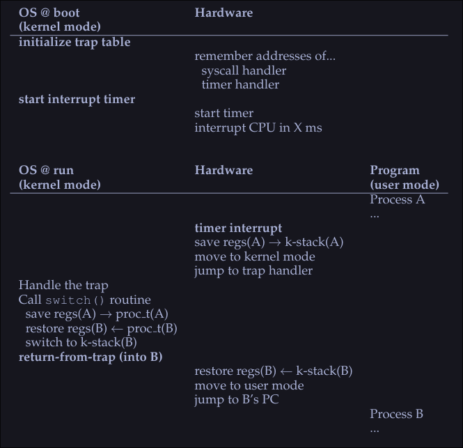

# 3. Mechanism - Limited Direct Execution

*CPU virtualization: Run one process for a little while, then another one, and so forth. By time sharing the CPU, virtualization is achieved.*

-  Challenges in building this virtualization: 
	1. Performance: How to implement without adding excessive overhead to the system?
	2. Control: How to run processes efficiently while retaining control over the CPU?

## Crux: How to efficiently virtualize the CPU with control?

## Basic technique: Limited direct execution
- "Direct Execution" part: Run the program directly on the CPU
	- OS wishes to start a program running: 
		1. OS creates a process entry for it in a process list.
		2. Allocate some memory for it.
		3. Loads the program code into memory (from disk)
		4. Locates its entry point, jumps to it and starts running the users' code
	  * Problems:
		  1. How can the OS make sure the program doesn't do anything that we don't want it to do, while still running efficiently.
		  2. How to do the context switch (stop the program and switch to another process) to time share the CPU thus virtualizing it. 

## Problem #1: Restricted operations 
**Crux: A process must be able to perform I/O and some other restricted operations, but without giving the process complete control over the system. How can the OS and hardware work together to do so?**

- Approach: Introduce a new processor mode: *user mode* 
	- Code that runs in user mode is restricted in what it can do (i.e it can't issue I/O requests)
	- Contrast to *user mode*: *kernel mode* - Code that runs in *kernel mode* can do what it likes.

How can we perform some kind of privileged operation (such as reading from disk) if we are on user mode?
- We provide the user the ability to do **system calls**. 
### System calls
They allow the kernel to carefully expose certain key pieces of functionality to user programs, such as:
- Accessing the file system
- Creating and destroying processes
- Communicating with other processes 
- Allocating more memory
Most OS provide a few hundred calls.

#### How to do a system call?
- Program executes a special **trap** instruction. 
- Trap instruction jumps into the kernel and raises the privilege to kernel  mode
- Once in kernel mode, the system can now perform whatever privileged operation that's needed (if allowed), hence doing the required work  for the calling process. 
- When it operation it's finished, OS calls a special **return-from-trap** instruction that returning into the calling user program while reducing the privilege level back to user mode. 

#### How does the trap knows which code to run inside the OS?
- Clearly the calling process can't specify an address to jump to (bad idea since you will be jumping to anywhere into the kernel)
- Kernel controls what code executes upon a trap by setting up a trap table at boot time.
- The OS tells the hardware what code to run when a certain exception event occurs. 
- To specify an exact system call, a system-call number is usually assigned to each system call. 
- The user code, is responsible for placing the desired system-call number in a register or location on the stack. 
- The OS, when handling the system call inside the trap handle, examines the number, ensures it's valid and executes the corresponding code if it is.

### Example: 
Process want to read a file. 
- Program calls the `read` function with the proper function arguments. 
- `read` loads the system call number `5` (for xv6-riscv) into the `a7` register
- `read` execute the `ecall` instruction to trigger the exception (trap)
- Now on kernel mode, it sees that an exception/trap has occurred
- The kernel saves the user registers on to a special place on memory/cpu
- The kernel reads the `a7` register, saves the number and calls the system call with the corresponding number
- When the system call finishes, it places the resulting return value into register `a0` of the user program
- Kernel calls `usertrapret` function which returns to user space and restores the cpu registers
- Now back to user space, the user program continues the execution with the result of the system call. 

## Problem #2: Switching between processes
**Crux: How can the operating system regain control of the CPU so that it can switch between processes?**

### Cooperative approach
The OS *trusts* the processes of the system to behave reasonably. Processes that run for too long are assumed to periodically give up the CPU so that the OS can decide to run some other task. 
- Most processes transfer control of the CPU to the OS by making system calls.
- Processes transfer control to the OS when they do something illegal (dividing by zero, trying to access memory that it shouldn't, etc)
Problems: 
- Process ends up on an infinite loop, the OS never regains control
- Malicious process intentionally never gives up the CPU

### Non-Cooperative Approach: The OS Take Control
- The OS uses a timer interrupt; A device that's programmed to raise an interrupt every so many milliseconds; when the interrupt is raised, the currently running process is halted and a pre-configured interrupt handle in the OS runs. 
- OS regained control of the CPU and it can do what it pleases
- On boot time the OS tells the hardware which code to run when a timer interrupts happens. 
- On boot time the OS must start the timer

### Saving and restoring  context
The OS has regained control and now has a decision to make: 
- To continue running the currently-running process 
- To switch to a different process

#### Switch to a different process
If the decision if to switch to a different process, the kernel executes a low level piece of code known as a context switch: 
- The OS will execute some low-level assembly to save :
	- General purpose registers 
	- PC (program counter)
	- Kernel stack pointer of the currently running process
- The OS will restore
	- General purpose registers
	- PC (program counter)
	- Switch to kernel stack of soon to be run process
By switching stacks, the kernel does the context switch. 

When the OS finally execute a return-from-trap instruction, the soon-to-be-executing process become the currently running process, and thus the context switch is complete. 

