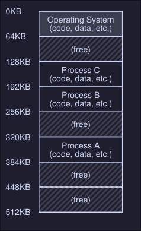
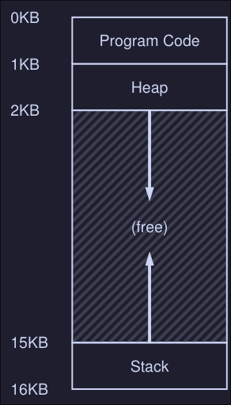

# 7. Address Spaces
Early machines didn't provide much of an abstraction of memory to users, the OS sat in memory (i.e. at address 0) and there would be one running program that currently sat in physical memory and used the rest of memory. 

## Multiprocessing and time sharing 
What we do is leave processes in memory while switching between them, allowing the OS to implement time sharing efficiently. 

In the diagram, there are three processes (A, B and C) and each of them have a small part of the 512KB physical memory carved out for them. Assuming a single CPU, the OS chooses to run one of the processes (i.e A), while the others sit in the ready queue waiting to run. 

This creates an **issue**: You don't want a process to access or modify memory of other processes. 

## The address space
- The address space is the running program (process) view of memory in the system
- Contains all of the memory state of the running program. This is:
	- The code of the program
	- Stack to keep track of where it is in the function call chain
	- Stack to allocate local variables and pass parameters and return values to and from routines
	- Heap used for dynamically allocated user-managed memory
 

### Example 

- Here we have the program code at the top of the address space, this is because the code has a static size and wont grow. 
- Next the heap is located right after the code
- The stack is located at the bottom of the address space
- This placement of both the heap and the stack is to allow them to grow in size while the program is running. 
- The heap grows positively and the stack negatively
- **This address space is an abstraction provided by the OS**, the program isn't really at memory address 0 through 16KB; it is loaded at some arbitrary physical address(es) 

## Crux: How to virtualize memory
How can the OS build the abstraction of private, potentially large address space for multiple running processes on top of a single, physical memory? 

## Goals 
What the OS should have to implement memory virtualization the right way? 
- **Transparency:** OS should implement virtual memory in a way that's invisible to the running program. The program shouldn't know that is working on virtualize memory. 
- **Efficiency:** OS should make virtualization: 
	- Time efficient
	- Space efficient (not using to much memory to implement virtualization)
- **Protection:** OS should protect processes from one another, one process should not be able to to access or affect the memory of another process. 
