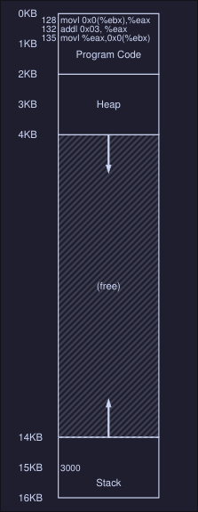

# Mechanism - Address Translation

## Introduction
**Definition:** With address translation, the hardware transforms each memory access(e.g, an instruction fetch, load, or store) changing the virtual address provided by the instruction to a physical address where the desired information is actually located. 

- With every memory reference, a translation is done. 
- Hardware cannot do this by it's own, OS must manage memory (gets involved so the correct translations take place)
- The main goal it's to create an illusion that the running program has it's own private memory, where only his code and data reside. 
### Crux 
How to efficiently and flexibly virtualize memory? 
## Example: 
Suppose we have the following C program: 
```C
// simple.c
int main(void) {
	int x = 3000;
	x = x + 3;
	return 0;
}
```

To compile this code to assembly you can use `gcc`, on Linux: 
```bash
$ gcc -O0 -S -c simple.c -o simple.S
```
*Note: the `-O0` part is highly important as it disables compiler optimization, without this, the compiler might realize you aren't doing nothing between `int x = 3000;` and `x = x + 3;` and might optimize that into `int x = 3003;`*

This will generate a `simple.S` assembly file which you can inspect. On *x86-64* look for two consecutive instructions `movl` and `addl`
The compiler turns this code into assembly, which **might** look like this (in *x86* assembly): 
```assembly
128: movl 0x0(%ebx), %eax
132: addl $0x03, %eax
135: movl %eax, 0x0(%ebx)
```
In this code snippet: 
- Address of `x` has been placed in the register `ebx` 
- Value at `ebx` it's loaded to the general purpose register `eax` using `movl` instruction.
- `addl` adds 3 to `eax` 
- The final instruction stores the value in `eax` back into memory at that same location. 

The address space of this process might look like this: 

<center></center>

Here we can see: 
- The 3 instruction code sequence is located at address `128`
- The value of the variable `x` is at address 15KB (on the stack)

When the process run: 
- Fetch instruction at address 128
- Execute this instruction (load from address 15KB) 
- Fetch instruction at 132
- Execute this instruction
- Fetch instruction at 135
- Execute this instruction (store to address 15KB)

### Notes
- From this example program perspective, his address starts at 0 and ends at 16KB 
- However the OS might allocated the memory of this program somewhere else in memory (i.e between address 32KB and 48KB )
- The size it's the same however the location differs. 

## Dynamic (Hardware-based) Relocation
- It's a technique to do hardware-based address translation. 
- We'll need two hardware registers within each CPU:
	- One is called *base* register
	- The other the *bounds* (a.k.a *limit* register)
- This registers allows us to place the address space of a program anywhere in physical memory 
- Also called *base-and-bounds*
### Base 
Each program is written and compiled as if it is loaded at address zero, however when the program starts running, the OS decides where in physical memory the program is loaded and it set the registers to those values.  

When a memory reference happens in the running program, the process translate the memory in the following manner: 
```
physical address = virtual address + base
```
For example, in the previous example, when this instruction has to be fetched: 
```
128: movl 0x0(%ebx), %eax
```
The cpu first adds the value of the base register (in this case 32KB) to the 128 to get 32896. This is the physical  address of the instruction and now the CPU can fetch and execute this instruction.

Same happens when accessing the value `3000` at address 15KB, the base register value is added to get physical address 47KB.

### Bound
The point of this register is to make sure that all addresses generated by the process are legan and within the *bounds* of the process. 
- When a memory reference happens, the process will first check that the memory reference is *within bounds* (is legal), the bound limit helps with protection. 
- It can contain either the size of the address space or the physical address of the end of the address space. 

### Example translations 
We have a process with an address space of size 4KB that has been loaded at physical address 16KB:

|Virtual address | Physical address|
|-|-|
|0|16KB|
|1KB|17KB| 
|3000| 19384|
|4400|*Fault (out of bounds*|

## Operating system issues
There are a few critical junctures where the OS must get involved to implement our based-and-bounds version of virtual memory: 
1. The OS when a process is created must find space for its address space in memory. 
2. When a process is terminated, it must reclaim all of its memory to be used by other process. Cleaning all data structures associated with that process
3. When a context switch occur, the OS must save and restore the base-and-bound pair when it switches between processes. 
4. It must provide exception handlers. For example if a process tries to access memory outside of its bounds, the CPU will raise an exception; the OS must be prepared to take action when such an exception arises. 
