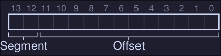
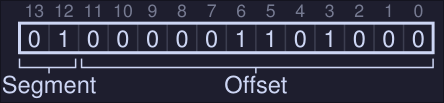

# 9. Segmentation
*Note: MMU = Memory management unit*
Problem with base-and-bound seen at *8* is that there is a big chunk of "free" space right in the middle, between the stack and the heap.
The simple approach of using base and bound register pair to virtualize memory is wasteful and it doesn't help us either when the memory of the program is bigger than the address space. 

## Crux: How to support a large address space 
How do we support a large address space with a lot of free space between the stack and the heap?

## Segmentation: Generalized Base/Bounds
Instead of having a base and bounds per address space, we have base and bound per logical segment of the address space. 
- Segment: Contiguous portion of the address space of a particular length. In our case, we have code, stack and heap. 
- Segmentation allows us to place each one of this segments in different places in physical memory

<center></center>

In this figure we can see the different segments (Stack, Code and Heap) of a process. Each one is located independently of one another and only used memory is allocated space in physical memory, thus large address spaces with large amount of unused address space can be accommodated. 

- The hardware structure in our MMU is a set of 3 base and bound register pairs:

|Segment|Base|Size|
|-|-|-|
|Code|32K|2K|
|Heap|34K|3K|
|Stack|28K|2K|

### Example translation

<center></center>


If we have a program with the address space of the figure above and is placed on physical memory as the first figure illustrated. 
*Note: Offset is defined as the "distance" between the virtual address we are referencing and the start of the segment
- Reference virtual address 100 (Code): The hardware adds the `base` value (see first table) to the *offset* into this segment (100 in this case). Physical address: 100 + 32KB = 32868
- Reference to virtual address 4200 (heap): The offset of this segment is 4200 minus 4KB because the heap starts at address 4K. Then we add the base value (34K) to the calculated *offset* (104) to get 34920
- In general the operation is (For positive growing segments): 
```
offset = (virtual mem value - segment start value virtual mem)
physical address = offset + segment base
```
* For the heap: 
	* Segment start value at virtual memory = 4KB
	* Virtual mem value (the address we want to reference) = 4200
	* Base heap value = 34K
	- Physical address = (4200 - 4096) + 34816 = 34920

## Which segment are we referring
Explicit approach chop up the address space in segments based on the top few bits of the virtual address. If our example we have 3 segments so we need 2 bits to represent each one, hence we will use the top 2 bits of our 14-bit virtual address to select the segment. 

<center></center>

 - If the top bits are 00, the virtual address is in the code segment, if it's 01 then it's in the heap segment.

- If we wanted to refer to virtual address 4200, which can be seen in binary form as: 

<center></center>

- We see that our segment is 01 (Heap) on our offset value in decimal is 104. We add the base register to the offset and we get the physical address

- If base and bounds where arrays, the hardware would be doing something like this to obtain the desired physical address 
```C
// Get top 2 bits of 14-bit VA
Segment = (VirtualAddress & SEG_MASK) >> SEG_SHIFT
/// Now get the offset
Offset = VirtualAddress & OFFSET_MASK
if (Offset >= Bounds[Segment])
	RaiseException(PROTECTION_FAULT)
else
	PhysAddr = Base[Segment] + Offset
	Register = AccessMemory(PhysAddr)
```

#### Issues: 
- When we use the top two bits and only have 3 segments, one segment of the address space goes unused. 
- It limits use of the virtual address space, each segment is limited to a maximum size (4KB in this case because that's the max number that can be represented using 12 bits = 14 bits - 2 top bits). If we want a bigger segment we are out of luck. 
####    Possible fixes: 
- Implicit approach: The hardware determines the segment by noticing how the address was formed. 

## The stack
In our first diagram, we can see that our stack is located at physical memory 28KB but with one critical difference: *it grows backwards*
- In physical memory it starts at 28KB and grows back to 26KB
* Corresponding to virtual address 16KB to 14KB

To keep track of the direction a segment grows we need help from the hardware (register set to 0 indicates negatives grow and 1 indicates positive grow)

|Segment|Base|Size|Grows Positive?|
|-|-|-|-|
|Code|32K|2K|1|
|Heap|34K|3K|1|
|Stack|28K|2K|0|

### Stack address translation
In this example we want to access virtual address 15KgB
- The stack segment starts at 16KB, hence the offset is 15KB - 16KB = -1KB
- The base of the stack is at physical address 28KB, hence the address we want to access is at -1KB + 28KB = 27KB 
- Bound is check by checking that the absolute value of the negative offset (1KB in this case) is less than or equal to the segment's current size (2KB in this case)

## Support for sharing
We can also add support for sharing segments of memory between address spaces.
- We need extra hardware support in the form of protection bits. 
- Protection bits: Adds a few bits per segment indicating if a segment can be read, write and/or executable
- If you set a code to read only, you can share it across multiple processes, without worry of harming isolation. 
With this, we now have the following segment registers values:

|Segment (Top bit)|Base|Size|Grows Positive?|Protection|
|-|-|-|-|-|
|Code (`00`)|32KB|2KB|1|Read-execute|
|Heap (`01`)|34KB|3KB|1|Read-Write|
|Stack (`11`)|28KB|2KB|0|Read-Write|

- With this, the hardware algorithm seen before now has to check that the segment where that a virtual memory is referencing, has the proper permissions (read, write or execute) 

## Fine-grained vs. Coarse-grained Segmentation
- Segmentation with a few segments (i.e just Code, Heap and Stack): coarse-grained
- Coarse grained segmentation: Chops up the address space into relatively large coarse chunks
- In contrast: Large number of smaller segments is referred to as fine-grained segmentation.
- To support fine-grained segmentation we need even further hardware support with a segment table of some kind stored in memory.

## OS Support 
#### Segmentation raises a number of new issues for the operating system: 
1. What should the OS do on a context switch? Segment registers must be saved some place in memory and restored. 
2. OS interaction when segments grow (or shrink). If a program calls `malloc()` to allocate space on the heap, but there isn't enough available memory to allocate this, the heap segment must grow, in this case, the memory-allocation library will perform a system call to grow the heap (i.e. `sbrk()` on Linux), the OS would then grow the segment size and updating the segment size registers to the new size, and informing the library of success (or failure if there isn't enough space or an arbitrary limit has been reached.)
3. Managing free space in physical memory. When a new process is created we have to allocate the address space in physical memory, however, the size of each segment is not constant now. This arises a problem, physical memory quickly becomes full of little holes of free space, making it difficult to allocate new segments (this problem is known as **external fragmentation** )
#### Possible solutions: 
1. Compact physical memory: By rearranging the existing segments, we compact the physical memory. If a process segment doesn't have enough space in his current position at the physical memory, move it entirely to new part of the physical memory, updating the segment registers. 
	- This is expensive (CPU and Memory wise) 
	- Uses a fair amount of processor time
 2. Use a free-list management algorithm that tries to keep large extents of memory available for allocation (There are hundred of this kind of algorithms)
